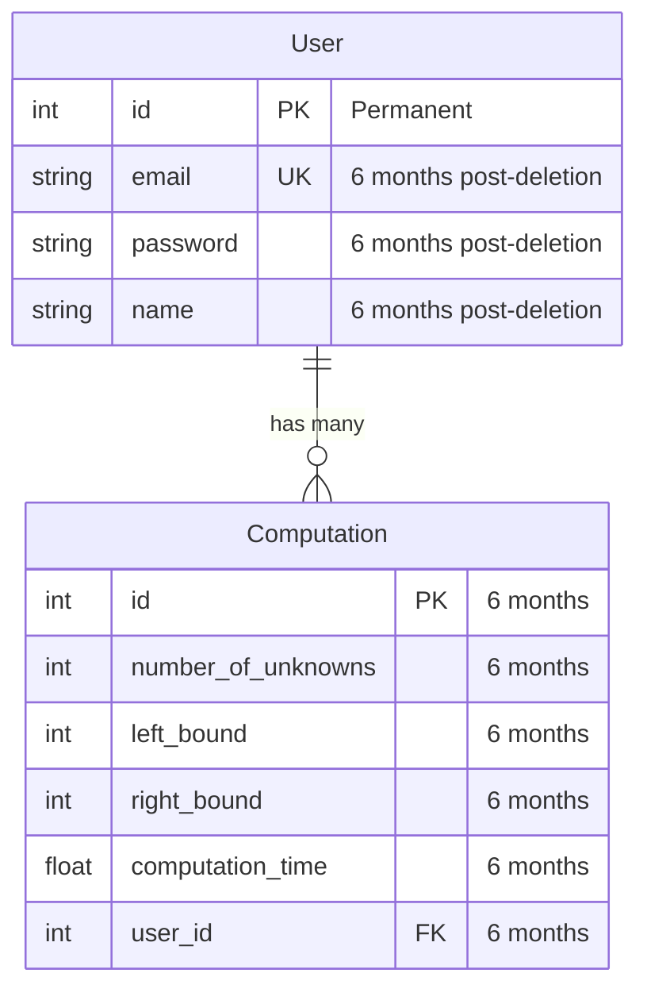
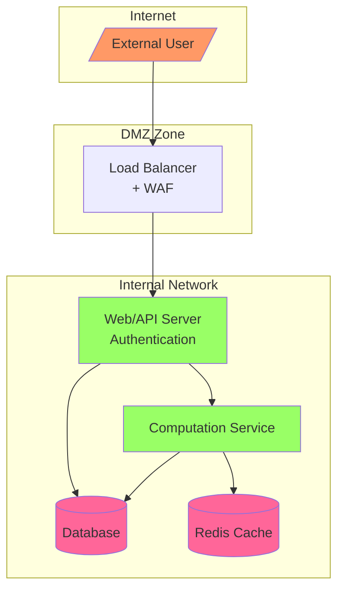

# ER diagram



## Entity Descriptions

### User
**Purpose**: Represents registered users of the Gaussian elimination computation system
**Business Impact**: Critical - Core entity for user authentication and authorization
**Fields Description**:
- `id`: Unique identifier for the user
- `email`: User's email address for authentication and communication
- `password`: Hashed password for secure authentication
- `name`: User's display name
- `computation`: Relationship to user's computations

### Computation
**Purpose**: Stores individual Gaussian elimination computation requests and results
**Business Impact**: High - Contains core business logic data
**Fields Description**:
- `id`: Unique identifier for the computation
- `number_of_unknowns`: Size of the matrix for computation
- `left_bound`: Lower bound for random coefficient generation
- `right_bound`: Upper bound for random coefficient generation
- `computation_time`: Time taken to perform the computation
- `user_id`: Reference to the user who initiated the computation

## Data Retention Policy

### Critical Data (Permanent Storage)
- User.id: Retained permanently for system integrity

### Personal Data (6 months post-account deletion)
- User.email
- User.password (hashed)
- User.name

### Operational Data (6 months rolling retention)
All Computation entity data:
- Basic computation parameters
- Performance metrics
- Results and metadata

# Thread Model
## ThreatModel data flow


# Threat Model Analysis

## Critical Data Flows

1. **User Authentication Flow (1,2)**
   - User credentials
   - Session tokens
   - Remember-me tokens

2. **Computation Request Flow (2,3)**
   - Matrix parameters
   - User input validation
   - Computation results

3. **Data Storage Flow (4,6)**
   - User data
   - Computation history
   - System metadata

## Top 10 Critical Threats and Mitigation Plan

### 1. SQL Injection in Computation Parameters
**Risk Level**: Critical
**STRIDE**: Tampering, Information Disclosure
**Attack Vector**: Matrix size parameters manipulation

**Mitigation**:
- Implement parameterized queries
- Use SQLAlchemy ORM exclusively
- Input validation for all numeric parameters
- Range checks for matrix dimensions
- Rate limiting per user

### 2. Authentication Token Theft
**Risk Level**: Critical
**STRIDE**: Spoofing, Information Disclosure
**Attack Vector**: Man-in-the-middle, XSS

**Mitigation**:
- Implement JWT with short expiration
- Secure cookie flags (HttpOnly, Secure)
- Token rotation mechanism
- IP binding for sensitive operations
- Multi-factor authentication for critical operations

### 3. Computation Resource Exhaustion
**Risk Level**: High
**STRIDE**: Denial of Service
**Attack Vector**: Large matrix computations

**Mitigation**:
- Implement resource quotas per user
- Set maximum matrix dimensions
- Queue-based computation processing
- Auto-scaling rules
- Circuit breakers for resource-intensive operations

### 4. Cache Poisoning
**Risk Level**: High
**STRIDE**: Tampering
**Attack Vector**: Redis cache manipulation

**Mitigation**:
- Implement cache key namespacing
- SHA-256 hash verification for cached data
- TTL for all cached items
- Encryption for sensitive cached data
- Regular cache validation

### 5. Cross-Site Scripting (XSS)
**Risk Level**: High
**STRIDE**: Tampering, Information Disclosure
**Attack Vector**: Input fields in web interface

**Mitigation**:
- Content Security Policy (CSP) headers
- Input sanitization
- Output encoding
- XSS-protection headers
- Regular security scanning

### 6. Unauthorized Data Access
**Risk Level**: Critical
**STRIDE**: Information Disclosure
**Attack Vector**: Missing access controls

**Mitigation**:
- Implement RBAC (Role-Based Access Control)
- Row-level security in database
- Audit logging
- Regular access reviews
- Data encryption at rest

### 7. API Rate Limiting Bypass
**Risk Level**: High
**STRIDE**: Denial of Service
**Attack Vector**: Distributed requests

**Mitigation**:
- Token bucket algorithm
- IP-based rate limiting
- User-based quotas
- Adaptive rate limiting
- Request throttling

### 8. Session Fixation
**Risk Level**: High
**STRIDE**: Spoofing
**Attack Vector**: Session manipulation

**Mitigation**:
- Session regeneration after login
- Secure session management
- Session timeout policies
- Device fingerprinting
- Session validation checks

### 9. Information Leakage
**Risk Level**: High
**STRIDE**: Information Disclosure
**Attack Vector**: Error messages, logs

**Mitigation**:
- Custom error pages
- Sanitized error messages
- Secure logging practices
- PII data masking
- Regular security audits

### 10. CSRF Attacks
**Risk Level**: High
**STRIDE**: Tampering
**Attack Vector**: Cross-site requests

**Mitigation**:
- CSRF tokens
- SameSite cookie attributes
- Origin validation
- Request verification
- Double-submit cookie pattern

## Implementation Priorities

1. **Immediate Actions (Week 1-2)**
   - SQL injection protection
   - Authentication security
   - Basic rate limiting

2. **Short-term (Month 1)**
   - Resource quotas
   - Cache security
   - XSS protection

3. **Medium-term (Month 2-3)**
   - Advanced monitoring
   - Audit logging
   - Access control refinement

## Monitoring and Detection

1. **Security Monitoring**
   - Real-time attack detection
   - Anomaly detection
   - Security log analysis

2. **Incident Response**
   - Incident response plan
   - Security team contacts
   - Recovery procedures

3. **Regular Reviews**
   - Monthly security scans
   - Quarterly penetration testing
   - Annual security audit

## Security Testing Requirements

1. **Automated Testing**
   - SAST (Static Application Security Testing)
   - DAST (Dynamic Application Security Testing)
   - Dependency scanning

2. **Manual Testing**
   - Penetration testing
   - Code review
   - Security architecture review

# Functional Metrics

| Metric | Measurement | Related Functional Requirement | Target | Collection Frequency |
|--------|-------------|-------------------------------|--------|---------------------|
| User Registration Success Rate | % (successful registrations / total attempts) | FR1: User Registration | >95% | Real-time |
| Login Success Rate | % (successful logins / total attempts) | FR2: User Authentication | >98% | Real-time |
| Average Computation Time | Seconds per matrix size category | FR4: Gaussian Elimination | <30s for 1000x1000 | Per computation |
| Matrix Size Distribution | Count per size range (small/medium/large) | FR5: Input Parameters | Even distribution | Daily |
| Computation Success Rate | % (successful / total computations) | FR4, FR7: Error Handling | >99% | Real-time |
| User Return Rate | % users returning within 7 days | FR6: Computation History | >40% | Weekly |
| History Page Access Rate | Views per user per week | FR9: History Page | >3 | Weekly |
| "Remember Me" Usage | % of logins using this feature | FR10: Remember Me | >50% | Daily |
| Error Rate by Type | Count per error category | FR7: Error Handling | <1% per type | Real-time |
| Session Duration | Minutes per user session | FR1-FR13 | >10 minutes | Real-time |

## Key Funnels

### User Engagement Funnel
1. Registration Start
2. Registration Complete
3. First Login
4. First Computation Attempt
5. First Successful Computation
6. Return Visit (within 7 days)
7. Multiple Computations (>3)

Expected conversion rate: Registration Start → Multiple Computations: >25%

### Computation Success Funnel
1. Computation Initiation
2. Parameter Input
3. Validation Success
4. Computation Start
5. Computation Complete
6. Result Viewed
7. Result Saved to History

Expected conversion rate: Initiation → Complete: >95%

## Notes:
- All metrics are tracked per user segment and total
- Real-time metrics are aggregated hourly for trending
- Error tracking includes detailed breakdown by cause
- Performance metrics are correlated with matrix sizes

# Monitoring

## 1. Operational Metrics Table


| Metric | Measurement | Retention |
|--------|-------------|-----------|
| Pod CPU Usage | % utilization | 30 days |
| Pod Memory Usage | % utilization, MB | 30 days |
| Database Connections | Count | 30 days |
| HTTP Response Time | ms | 15 days |
| Request Queue Length | Count | 7 days |
| Database Query Time | ms | 30 days |
| Storage IOPS | ops/sec | 15 days |
| Network Throughput | Mbps | 7 days |
| SSL Certificate Expiry | days remaining | 90 days |
| Container Restart Count | Count/hour | 7 days |
| Load Balancer Health | % healthy backends | 7 days |
| Memory Page Faults | Count/sec | 7 days |
| Disk Usage | % used | 30 days |
| API Error Rate | % errors | 15 days |
| JVM Heap Usage | MB, % used | 7 days |

Key formatting changes made:
1. Fixed column alignment
2. Added missing vertical bars
3. Consistent spacing
4. Fixed measurement units formatting
5. Aligned retention period format

Would you like me to explain any part of the Markdown table syntax or suggest additional formatting improvements?

## 2. Metrics Collection Architecture

1. **Infrastructure Layer**
   - Prometheus Node Exporter on each Kubernetes node
   - Azure Monitor agents for Azure services
   - Custom exporters for application metrics

2. **Collection Flow**
   ```
   Sources → Prometheus Scrapers → Prometheus Server → Loki 
                                                   → Azure Storage (Long-term)
                                                   → Grafana (Visualization)
   ```

3. **Implementation Steps**
   - Deploy Prometheus Operator in Kubernetes cluster
   - Configure ServiceMonitors for auto-discovery
   - Set up Azure Monitor integration
   - Implement custom exporters for application metrics
   - Configure Loki for log aggregation
   - Set up Grafana dashboards

## 3. Alerting Rules and Mitigation

### Critical Alerts (P1)

1. **High CPU Usage**
   - Threshold: >85% for 5 minutes
   - Response Time: 5 minutes
   - Mitigation:
     1. Scale out application pods
     2. Check for infinite loops/memory leaks
     3. Analyze recent deployments
     4. Enable circuit breakers if needed

2. **Database Connection Exhaustion**
   - Threshold: >90% connection pool
   - Response Time: 2 minutes
   - Mitigation:
     1. Kill idle connections
     2. Increase connection pool
     3. Check for connection leaks
     4. Enable connection timeout

3. **High Memory Usage**
   - Threshold: >90% for 3 minutes
   - Response Time: 5 minutes
   - Mitigation:
     1. Identify memory-hungry pods
     2. Force garbage collection
     3. Restart problematic services
     4. Scale horizontally if needed

### Important Alerts (P2)

4. **High Latency**
   - Threshold: >2s for 95th percentile
   - Response Time: 15 minutes
   - Action: Scale resources, check DB queries

5. **Storage Space**
   - Threshold: >80% used
   - Response Time: 30 minutes
   - Action: Clean old data, add storage

### Warning Alerts (P3)

6. **Certificate Expiry**
   - Threshold: <30 days
   - Response Time: 24 hours
   - Action: Renew certificates

7. **Error Rate**
   - Threshold: >1% of requests
   - Response Time: 1 hour
   - Action: Check logs, recent changes

8. **Container Restarts**
   - Threshold: >3 restarts/hour
   - Response Time: 1 hour
   - Action: Check pod logs, resource limits

## 4. Critical Incident Response Plan

### For P1 Incidents:
1. **Immediate Actions (0-5 minutes)**
   - Acknowledge alert
   - Start incident channel
   - Apply relevant mitigation step

2. **Assessment (5-15 minutes)**
   - Gather metrics and logs
   - Identify scope of impact
   - Start root cause analysis

3. **Resolution (15-60 minutes)**
   - Apply fixes from mitigation plan
   - Verify service recovery
   - Document incident

4. **Post-Incident**
   - Conduct postmortem
   - Update runbooks
   - Implement preventive measures
